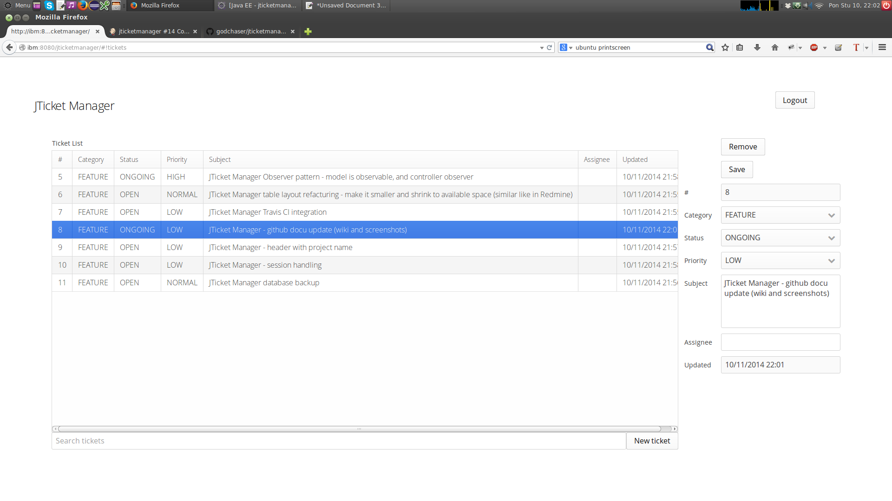

JTicket Manager
===============

Introduction
------------

**JTicket Manager** is a generic and simple open source issue tracking tool.
It has plain and simple straightforward user interface and basic issue tracking
functionality as seen like in professional issue tracking software (Redmine).

It's main advantage is small footprint and completely embedded functionality - no external
database needed. Everything is wrapped inside servlet and can be easily deployed in any 
Servlet 3.0 compliant servlet container (tested on Tomcat7 and Tomcat8). 
For ticket database [HSQLDB](http://hsqldb.org/) database is used.

Web service is built on [Vaadin framework](https://www.vaadin.com)

License
-------

JTicket Manager is open source software provided under under [Apache License 2.0](http://apache.org/licenses/LICENSE-2.0)

